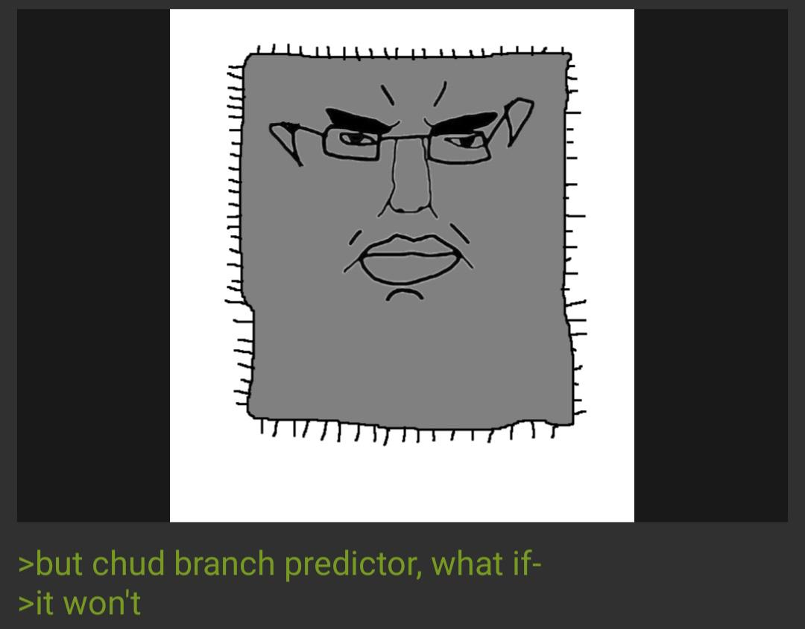

# Token Maxxer

Keeps your Claude subscription's 5 hour usage window running around the clock and optimized, so you wait less.

It sends one tiny message at the start of each usage cycle from a scheduled CI job. That first message is what starts the 5 hour clock. Fire it on a schedule and the clock is always ticking, which means you get the most usage windows per day that the plan allows.

## Why this exists

Claude subscriptions meter usage in a rolling 5 hour window. The window does not start on a fixed clock. It starts on your **first message** after the previous window resets, and runs for 5 hours from there.

Assuming you go at work at 8 a.m. and expect to reach the plan cap within two hours, you can set the first cycle to begin at 5 a.m., allowing you to wait three hours less and avoid waking up in the middle of the night to activate it. It also cycles throughout the day, so you don't have to worry about it when you're on your lunch break.

## The cycle model

A day is 24 hours. A cycle is 5 hours. Four cycles cover 20 hours:

```
05:00 ┌──────────── cycle 0 ─────────────┐
      │                                  │
      │                                  │
10:00 ├──────────── cycle 1 ─────────────┤
      │                                  │
      │                                  │
15:00 ├──────────── cycle 2 ─────────────┤
      │                                  │
      │                                  │
20:00 ├──────────── cycle 3 ─────────────┤
      │                                  │
      │                                  │
01:00 ├──────────── cycle 5 ─────────────┤
      │//////////////////////////////////│ Skipped
06:00 └──────────────────────────────────┘
```

The fifth cycle is deliberately skipped. Four cycles land at 20 hours, leaving a 4 hour gap from 1am to 5am. And it would take 24 days to re-anchor at 5am if it drifted. Skipping it means the next morning re-anchors cleanly at 5am instead of drifting an hour later every day.

## How it works

Three workflows on GitHub, one mirror on GitLab.

- `claude-keepalive.yml` is the worker. Wakes at the four hours and, if it is inside an active cycle, sends one message to start the window.
- `cycle-scheduler.yml` runs once a day. Rewrites the worker's cron for your timezone, commits that only when the schedule actually changed, and checks the token is alive.
- `anti-disable.yml` pushes an empty commit on a slow timer so the repo never goes quiet long enough for GitHub to disable the scheduled workflows.

## Setup

You need a Claude subscription (Pro or Max) and a GitHub account.

### 1. Get a long lived token

On your own machine, with the Claude CLI installed:

```bash
claude setup-token
```

This prints a long lived OAuth token built for headless use.

### 2. Fork or create the repo

Fork this repo, or push these files to a new one. If you fork, open the Actions tab once and enable workflows.

### 3. Add the secrets

In the repo, Settings > Secrets and variables > Actions.

Secrets:

| Name | Value |
|------|-------|
| `CLAUDE_CODE_OAUTH_TOKEN` | the token from step 1 |
| `KEEPALIVE_PAT` | a Personal Access Token, see below |

The PAT lets the scheduler push its cron rewrites. Create a fine grained token scoped to this repo with **Contents: Read and write** and **Workflows: Read and write**. It needs Workflows because the scheduler edits a file under `.github/workflows`.

### 4. Add the variables

Variables:

| Name | Example | Meaning |
|------|---------|---------|
| `TZ` | `America/Los_Angeles` | your timezone, standard tz database name |
| `CYCLE_START_HOUR` | `5` | when your first cycle starts, `H` or `H:MM` |

`CYCLE_START_HOUR` accepts whole hours like `5` or half hours like `4:30`. Anything outside 0 to 23 is rejected.

### 5. Kick it off

Two manual runs, once, in the Actions tab:

1. Run **cycle-scheduler**. This rewrites the cron to your timezone right away instead of waiting for the next daily run.
2. Run **claude-keepalive**. A manual run skips the gate and starts a window immediately, so you do not wait until the next boundary for your first one.

After that it runs itself.

## What a run costs

The message uses the cheapest model, one output token, no tools.

CI cost on GitHub:

- The worker wakes 4 times a day. On average, most runs bill 1 minute.
- The CLI is cached by version. A run only pays the full install when Claude Code ships a new version, which can be a few times a day. Those runs bill about 2 minutes.
- The scheduler runs once a day, about a minute.

Ballpark 150 to 250 minutes a month. See the PFAQ for how that fits GitHub's free minutes.

## Timezones and daylight saving

The anchor is a wall clock time in your timezone. `CYCLE_START_HOUR=5` with `TZ=America/Los_Angeles` means 5am Los Angeles time, winter or summer.

The scheduler recomputes the anchor from your timezone every run, so it is always correct. The cron wake times are stored in UTC and rewritten daily by the scheduler, so when daylight saving flips they catch up within a day. On the changeover day the wake times can be an hour stale for up to one cycle, which usually lands in the overnight dead zone anyway.

If you never observe daylight saving (Arizona, most of Asia) there is nothing to think about.

## When things break

| Failure | What happens | How you find out |
|---------|--------------|------------------|
| Token expires or is revoked | Pings stop working | Scheduler's daily health check fails, GitHub emails you |
| PAT expires | Scheduler cannot push, repo can drift toward auto-disable | Scheduler job fails, GitHub emails you |
| A cron job is late | Window opens a bit late | Nothing to do, self corrects |
| GitHub drops a cron job entirely | That one cycle is missed on GitHub | Mirrors (optional) cover it |
| Network or npm hiccup | Retry loop tries 8 times with backoff | Self corrects, or fails the job after 8 tries |
| Plan cap hit | Ping is refused, keepalive stops trying | Logged, exits clean, nothing to alert |
| Claude Code ships a breaking release | Worker installs latest every fire, never runs a stale client | Always current, no action |

The retry loop covers short outages inside a single run. It cannot hold a job open for hours, that would burn CI minutes, so a long outage is covered by the mirrors and the next boundary instead.

## Running redundant repos

You can fork this into several repos, or push it to both GitHub and GitLab, and run them all on the same schedule. No coordination needed.

A window starts on the **first** message. Every later message in that window, from any repo, does nothing but confirm the window is open. So the first repo to land at a boundary starts the window and the rest are harmless. More repos means more chances that at least one fires on time, and the cost of the extra pings is a single token each.

You cannot check whether a window is already open without sending a message, because the window state only comes back on a real message response. Since an extra send is free and harmless, there is nothing to gain by checking first. Just let them all fire.

## Potentially FAQ

**How much does this cost?**

Zero out of pocket. The Claude message runs against your subscription, and CI runners are free within GitHub's monthly allowance. The only thing you spend is CI minutes, and this setup uses about 150 to 250 a month.

**What does GitHub actually give you for free?**

Public repos get unlimited Actions minutes on standard runners, so running this in a public repo is free. Private repos get a monthly pool of free minutes instead, Free is 1000 minutes and Pro is 2000.

**Do I need to worry about running out of minutes?**

Only if your repo is private. At 150 to 250 minutes a month you have plenty of room, but if you also run heavy CI in the same repo, or fork this several times into private repos, it adds up. A private repo pools all its Actions usage into one monthly bucket.

If you want to stop thinking about it, make the repo public, or just create more GitHub accounts.

**Is the GitHub cron reliable?**

No, and you should plan around that. Scheduled workflows on GitHub are best effort. They routinely fire a few minutes late, run much later under load, and every so often a scheduled run gets dropped entirely. The top of the hour is the worst, since that is when everyone else schedules too.

The gate already handles late fires, a run that lands at 5:40 instead of 5:00 still counts. What it cannot fix on its own is a **run that never happens**.


